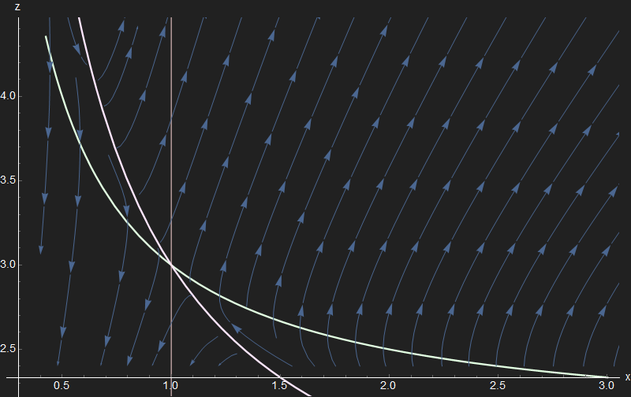

```{r setup, include=FALSE}
knitr::opts_chunk$set(echo = TRUE,
                      cache = T )
```

*This problem was written by George Evans and comes from the University of Oregon core macroeconomics exam, in July of 2013.*

## Setup

Imagine that at time $t$ there are $M_t > 0$ mosquitos carrying a deadly novel influenza virus around an economy with labor force $L_t > 0$. We are given the following equations of reproduction for the labor force, and the mosquito population:

\begin{align}

\dot{M} &= (\phi - \sigma)M_t - Z_t \\
\dot{L} &= nL_t - \phi M_t

\end{align}

Here, $\phi > 0$ is the growth rate of the virulent mosquito population and $\sigma > 0$ is the mortality rate of the mosquitos (at least, the ones with the virus). The labor force grows at rate $n > 0$. $Z_t > 0$ can be thought of, in general, as a good which abates the mosquitos who have the virus (i.e. mosquito repellant, or even as general as the disposal of food which the mosquitos feast upon). The abatement good and the consumption good $C_t > 0$ can each be produced using a production technology with unit labor requirements $a,b > 0$ ^[The careful observer will notice this equation is actually the production possibilities frontier for a given labor force.]:

\begin{align}

aZ_t + bC_t = L_t

\end{align}

We can take initial values $M(0) , L(0)$ as given.

## Task A

1. *Show, for a suitable constant $k$ depending on the parameters, that if $x = \frac{L}{M}$ and $z = \frac{Z}{M}$...*

$$ \dot{x} = (z-k)x - \phi $$

**Answer:**

Start off by noticing that given the definition of $x$, we can write 
$$\dot{x} \equiv \frac{dx}{dt} =  \frac{dLM^{-1}}{dt} = \frac{\dot{L}M - L\dot{M}}{M^2} $$

Breaking the difference apart and substituting yields
\begin{align} 

\dot{x} &= \frac{nL - \phi M}{M} - \frac{L}{M}((\phi - \sigma) - z) \\
        &= nx - (\phi - \sigma)x + zx - \phi \\
        &= (z - ((\phi - \sigma )- n) )x - \phi \\
\end{align}

Therefore $\dot{x} = (z-k)x - \phi$ for $k = (\phi - \sigma) - n$ as the problem asks for.

2. *Suppose policy aims to set $z = \bar{z} > 0$ constant over time. What would happen to $x$ over time if $k>0$ and $0<k<\bar{z}$?*

It's easy to see that for $\dot{x} = (z-k)x - \phi$ and $(z-k)<0$ by assumption, then given our other assumption that $x,\phi > 0$ it must be that $\dot{x} < 0 \ \forall \ t$. Thus the ratio of the human labor force (or human population as it were) to virulent mosquitos goes down forever, as the mosquitos/virus overtakes the human labor force.

## Task B

Disclaimer: The answer for several parts of this task admittedly go *much further* than requested in the question, in order to drill-down into what all is happening behind the scenes with this problem.

Now we are given $c_t = \frac{C_t}{L_t}$ and told to imagine a planner who wishes to maximize

$$U = \int^{\infty}_{0} e^{-\rho t} u(c_t) dt$$

subject to the familiar state constraint

$$ \dot{x} = (z-k)x - \phi$$

1. *Using $c = 1/b - \frac{az}{bx}$ and treating $x$ as the state variable and $z$ as the control, write down the Hamiltonian and the first-order conditions for an optimum.*

**Answer:**

We are given the state to be $z$ so the first order of business is to substitute the given formula for $c$ (which can even be derived from the production possibilities frontier equation for given $L$) into the utility function when we are forming the Hamiltonian:

$$ \mathcal{H_t} = u\left(\frac{1}{b} - \frac{a}{bx_t}z_t \right) + \lambda_t((z_t-k)x_t - \phi)$$

The first-order conditions for an optimum in this problem^[Ignoring the second-derivative issue by assuming concavity of $u(\cdot)$] are given by the following system of equations

\begin{align}

\frac{\partial u}{\partial c_t}\frac{d c_t}{d z_t} + \lambda_t x_t &= 0 \\

\dot{\lambda} = \rho \lambda_t - \frac{\partial \mathcal{H_t}}{\partial x_t} &= \rho \lambda_t - \left[\frac{\partial u}{\partial c_t}\frac{d c_t}{d x_t} + \lambda_t (z_t - k) \right] \\

\lim_{t \to \infty} e^{-\rho t}\lambda_t x_t &= 0 

\end{align}

One thing we'll need is $d c_t/d z_t$ and $d c_t/d x_t$ to solve this. Let's also just call $u' \equiv \frac{\partial  u}{\partial c_t}$

\begin{align}

\frac{d c_t}{d z_t} &= -\frac{a}{bx_t} \\
\frac{d c_t}{d x_t} &= (-1)\left(-\frac{az_t}{bx_t^2}\right)  \\
&= \frac{d c_t}{d z_t}\left(-\frac{z_t}{x_t}\right)

\end{align}

With these, let's substitute and re-write the first-order conditions:

\begin{align}
\left( -\frac{a}{bx_t}\right)u' + \lambda_tx_t &= 0 \\
\Rightarrow \lambda_t = \frac{a}{bx_t^2}u' &= \frac{d c_t}{d x_t}\frac{u'}{z_t} \\
\dot{\lambda} = \rho \lambda_t - \left[ (\lambda_t z_t) + \lambda_t z_t - \lambda_t k \right] &= (\rho - 2z_t + k)\lambda_t \\
\Rightarrow \frac{\dot{\lambda}}{\lambda_t} &= \rho - 2z_t + k

\end{align}

Notice the substitution made for $u'\frac{d c_t}{d x_t}$ on the third line. To finish out the model solution, all we need is a closed-form expression for $\dot{\lambda} \equiv \frac{d\lambda}{dt}$. For this particular model where $z_t$ is the control, this is about as painless as pulling your own tooth, and so George doesn't ask for this on the actual exam. We shall not be deterred so easily however. I'll mostly drop time subscripts from here on out.

\begin{align}

\lambda_t = \frac{a}{b}\frac{u'(z_t , x_t)}{x_t^2} \Rightarrow \frac{d\lambda}{dt} &= \frac{a}{b}\left[\frac{(d/dt \ u')x_t^2 - (d/dt \ x_t^2)u'}{x_t^4}\right] \\
&= \frac{a}{b}\left[\frac{u''\cdot(\frac{d c}{d z}\dot{z} + \frac{d c}{d x}\dot{x})x_t^2 - 2u'x_t\dot{x}}{x_t^4} \right] \\ 
&= \frac{a}{bx_t^2}\left[\frac{u''\frac{d c}{d z}(\dot{z} - \frac{z}{x}\dot{x})x_t^2 - 2u'x_t\dot{x}}{x_t^2} \right] \\
\Rightarrow \frac{\dot{\lambda}}{\lambda} = \frac{\frac{a}{bx^2}(u''\frac{d c}{d z}(\dot{z} - \frac{z}{x}\dot{x})x_t^2 - 2x_tu'\dot{x})/x_t^2}{\frac{a}{bx^2}u'} &= \frac{d c}{d z}\frac{u''}{u'}(\dot{z} - \frac{z}{x}\dot{x}) - 2\frac{\dot{x}}{x}

\end{align}

And we have it-- an expression for $\frac{\dot{\lambda}}{\lambda}$ that we can substitute into the first-order condition:
$$ \frac{\dot{\lambda}}{\lambda} = \frac{a}{bx}\frac{u''}{u'}\left(z\frac{\dot{x}}{x} - \dot{z}\right) - 2\frac{\dot{x}}{x} $$

As we substitute this into the left-hand side of the first-order condition derived earlier, we'll divide both sides of the FOC by $z$.

$$\frac{a}{bx}\frac{u''}{u'}\left(\frac{\dot{x}}{x} - \frac{\dot{z}}{z}\right) - \frac{2}{z}\frac{\dot{x}}{x} = \frac{\rho + k}{z} - 2$$

It will be helpful here to substitute $\dot{x} = (z-k)x - \phi$ at this point.

\begin{align}

\frac{a}{bx}\frac{u''}{u'}\left[z - k - \frac{\phi}{x} - \frac{\dot{z}}{z}\right] - \frac{2}{z}\left[(z-k) - \frac{\phi}{x}\right] &= \frac{\rho}{z} + \frac{k}{z} - 2 \\
\Rightarrow \frac{a}{bx}\frac{u''}{u'}\left[ z - k - \left( \frac{\dot{z}}{z} + \frac{\phi}{x}\right) \right] + \frac{2 \phi}{zx} &= \frac{(\rho - k)}{z} \\
\Rightarrow \frac{a}{bx}\frac{u''}{u'}\left[ z - k - \frac{\dot{z}}{z} - \frac{\phi}{x} \right] &= \frac{(\rho - k) - 2\phi/x}{z} \\
\Rightarrow \frac{u''}{u'}\left[ z - k - \frac{\dot{z}}{z} - \frac{\phi}{x} \right] &= \frac{b}{a}\left[\frac{(\rho - k)x - 2\phi}{z}\right] \\
\Rightarrow z - k - \frac{\dot{z}}{z} - \frac{\phi}{x} &= \frac{b[(\rho - k ) - 2\phi]}{az\frac{u''}{u'}} \\
\Rightarrow \frac{\dot{z}}{z} &= z - \frac{\phi}{x} - k - \frac{b(\rho - k)}{a\frac{zu''}{xu'}} - \frac{2b\phi}{az\frac{u''}{u'}} \\
\Rightarrow \frac{\dot{z}}{z} &= z - \left( \frac{\phi}{x} + \frac{\phi}{x}2b\frac{xu'}{azu''} \right)- b(\rho - k)\frac{xu'}{azu''} - k

\end{align}

Now that we've set-up and even solved the Hamiltonian, let's turn to the second part of this questuon before we totally close this part of the model off.

2. *For suitable U it can be shown that the first order conditions imply*
$$\frac{\dot{z}}{z} = z - (1+\xi)\phi x^{-1} - A$$
*for constants A and $\xi>0$. (You are not asked to show this). Compute the slopes dz/dx for the two curves $\dot{x} = 0$ and $\dot{z} = 0$.*

George ultimately gave us the biggest hint here; "For suitable U..." We very often see utility functions for which $$\frac{cu''(c)}{u'(c)} = \frac{1}{s'}$$ for a constant $s'$.^[These are called "constant relative risk aversion" utility functions.] This function will need to be similar, with slight differences though. Given our equation derived from the production possibilities frontier, $\frac{az}{x} = (1-bc)$, we could posit that

$$ \frac{azu''}{xu'} = \frac{1}{s} = \text{constant}$$

This would be fulfilled, for instance, if $u = c - \gamma c^2$ and $b = 2\gamma$. Regardless, if we take this to be fulfilled in a manner similar to the hint in the question, then for $\xi = 2bs$ and $A=b(\rho - k)s + k$ then sure enough,

$$\frac{\dot{z}}{z} = z - (1+\xi)\frac{\phi}{x} - A$$

Adopting this notation going forward, we can see from setting $\dot{x} = 0 = (z - k)x - \phi$ we'll have $\tilde{z}= \frac{\phi}{\tilde{x}} + k$ and then

$$ \left. \frac{dz}{dx} \right\rvert_{\dot{x} = 0} = -\frac{\phi}{x^2}$$

Likewise if we set $\dot{z} = 0 = z(z - (1+\xi)\frac{\phi}{x} - A)$ then we get $\hat{z}= (1+\xi)\frac{\phi}{\hat{x}} + A$ and in that case,

$$ \left. \frac{dz}{dx} \right\rvert_{\dot{z} = 0} = -(1+\xi)\frac{\phi}{x^2}$$
3.*Assuing a unique positive steady-state(\bar{x},\bar{z}), shetch the phase diagram is (x,z) space. Indicate the optimal path from initial $x(0)$ to the steady state.*

I can't over-emphasize the importance of being able to quickly assess phase diagrams. Many an exam score has been harmed by confusion over drawing them! I've provided a fleshed-out phase diagram of this problem below, called a "stream plot," which is similar to a vector plot of a phase diagram except for instead of point vectors, there are many different diverging paths drawn starting at various points. You'll need to fill-in the saddle path on your own, but the figure below should offer intuition for how this model's phase diagram works.

```{r, echo=F, fig.align='center', out.height='80%', out.width='80%'}

```

In the figure, the lighter green curve is the $\dot{x} = 0$ envelope and the lighter pink curve is for $\dot{z}=0$. A vertical line has been drawn at the steady-state value $x=\bar{x}$. The parameter values used for this were $\xi = \phi = A = 1$ with $k = 2$ since this problem actually requires $k > A$ for a truly "nice" interior solution.^[I encourage you to mess-around and figure out why this would need to be the case.]