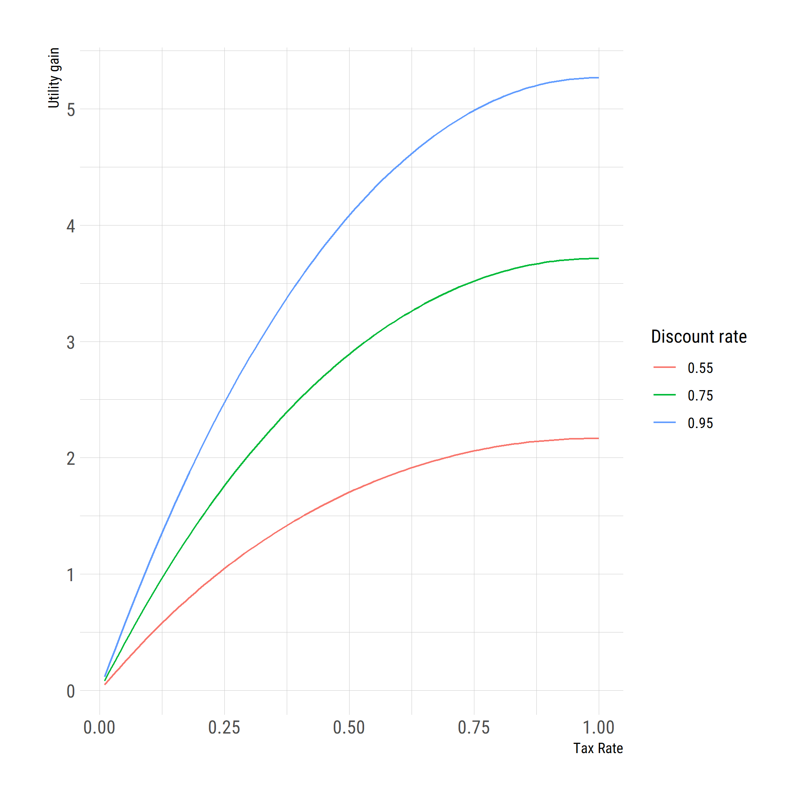

Background
----------

The first thing economics students typically learn about taxation is
simply that it reduces surplus in a market that’s in a competitive
equilibrium (see pic). While true, this is a highly incomplete summary
of what economics has to say about taxation. Without additional context,
economics students may attach to this very specific case and become
overly-skeptical of legitimate roles of taxation and government
intervention.

Taxation in otherwise-“flawless”[1] markets is not the only thing which
can reduce consumer surplus, though, and there has been a [large amount
of ink spilled](https://en.wikipedia.org/wiki/Theory_of_the_second_best)
about the ways that taxation and government intervention can actually
improve consumer well-being. The case examined here: risk. Specifically,
lifetime income risk.

In the above graph, the solid black line shows how a worker’s well-being
increases with their consumption– it has diminishing returns (more is
better overall, but you don’t savor the first bite as much as the last).
The situation described on the graph is where a worker faces a risk of
ending up with a “low” consumption level *x*1 or a “high”
consumption level *x*2. This gamble gives the worker a level
of well-being somewhere along dashed line segment connecting the two
points of the solid line curve (where, exactly, depends on the chance of
winning/losing the gamble). Unless the chance of winning is exactly 0%
or 100%, the worker would **absolutely** be better-off receiving some
*guaranteed* amount of *x* between the two outcomes. Even with a 99%
chance of winning the amount *x*2, we could find an amount
slightly less than *x*2 that would make the worker happier if
they knew they’d get it for certain.

In daily life, individuals face all sorts of risks that have little to
do with their choices, but could have huge consequences for their
lifetime earnings and thus their overall well-being. What if there was a
way to remove a lot of this risk from people’s lives? We just saw that
if we could have some other group take the risk away from the worker and
convert it into a guaranteed payment, it would make them better off. Hal
Varian, famous microeconomist and Chief Economist at Google, [showed how
the government could be the one to
step-in](https://www.sciencedirect.com/science/article/abs/pii/0047272780900043)
and use taxation to insure individuals against income risk.

The model
---------

For a deep mathematical treatment, refer to the [aforementioned Varian
paper](https://www.sciencedirect.com/science/article/abs/pii/0047272780900043).
In English, I will assume that workers go to work and save during an
early period of their life, and retire in the later period of their
life, which is also when they face some “catastrophic risk” that could
significantly affect their well-being. I allow the government to tax
workers’ income and rebate it to them in the form of what Varian calls a
[“demogrant,”](https://en.wikipedia.org/wiki/Citizen%27s_dividend) which
reduces the overall income risk the workers face.

Up until generation 100, there is no tax and no rebate– consumers
passively accept the uncertainty with their income, and try to adjust
their savings to compensate. Upon the 100th generation, the government
steps in and imposes a tax rate of 50%, and fully rebates it to
consumers. Visible in the figure, this reduces the variation in
retirement consumption.

In the second figure above, the tax rate is instead 100%– all unexpected
income is confiscated by the tax and fully rebated to the workers. It
works– there is no uncertainty in retirement income anymore.

### Effect on workers’ well-being

So we showed that the government can tax-away uncertainty. While we have
a vague sense that the decision-makers dislike risk, there are still a
number of channels in this model (investment, wages, interest rates,
economic output) that act to un-do this risk aversion. So let’s vary the
tax rate from 1% to 100% and run the simulation 1,000 times for each tax
rate, calculating the difference in well-being for each tax rate.

By adjusting the workers’ “patience” or “discount” factor– they might be
less-patient, preferring immediate reward to having higher well-being in
retirement[2]– we can see that the tax always leaves our decision-makers
unambiguously better off. In fact, it will be best to have full (or
near-full) insurance against risk of this type. These gains furthermore
represent a substantial improvement in quality of living– when
translated into a real-world reference point, from these model units,
they’d amount to tens of thousands of dollars of lifetime income.

### Effect on other economic variables

As we can see, lower lifetime income uncertainty significantly boosts
worker savings, which increases capital per worker as well as GDP per
capita and wages. The higher level of capital per worker reduces the
return on capital slightly. My suspicion is that this is what leads to
the “bent” shape of the well being gain with respect to a higher tax
rate– reducing uncertainty boosts average consumption (thus well-being),
but by also reducing the return on capital, it reduces available
retirement income by a slight amount, too. In the Varian model this
effect doesn’t exist because he does not consider effects on capital
market (which may not have been as computationally-simple back in the
early 1980s).

Discussion
----------

The take-away from the exercise above is that even substantial risk in
lifetime income can be overcome with a basic public insurance scheme
that requires no search and purchase of a private contract. One might
ask why there *wouldn’t* be a private insurance market in this model,
because we certainly do rely on private insurance to cover many
real-world risks. However, we live in a vast world full of risks for
which there are no insurance markets, for various reasons. Historically,
for instance, citizens of the United States who had an illness diagnosed
and recorded in their medical history may have been disqualified by
private health insurers from obtaining a policy that could mitigate
their risk. Many wealthy countries dispense with this by offering
blanket universal health coverage.

As another example, think about a worker who might be worried that their
particular job becomes automated and they have trouble staying in their
occupation in the long-term. This situation is not unfamiliar to many
Americans, particularly in the Midwest who had manufacturing jobs in the
1970’s. These are examples of what economists call “missing market”
problems– there’s no insurer a potentially-vulnerable industry employee
can call to write a contract to offset their occupation risk. In
general, we see huge earnings inequality/variation even within
occupations and parental class which is ostensibly due to chance or
accident[3], and this model illustrates the possibility for
redistributive taxation to improve overall well being in such cases.

A related problem for many kinds of private insurance comes with the
fact that even if they could in principle draw a contract to insure many
kinds of risk, they may find enforcement or other transaction costs too
high to justify a market. Specifically, a particular risk may exist
among a group or groups which are too small to insure at a minimum
“efficient scale”– the premium that an insurer would have to offer the
small group might be too high for some who would otherwise be willing
and able to buy the contract *at a competitive price*. These sorts of
transaction costs are another issue that can prevent the formation of
efficient private insurance markets.

Conclusion
----------

We have seen that when workers and consumers face lifetime income risk,
it can depress savings and economic output. We have also seen how a
linear tax aimed at redistributing random gains and losses can mitigate
the income risk and boost economic output and overall welfare. Private
insurance markets can and do serve a similar purpose to this tax in the
real world. Unfortunately, there are a number of deep conceptual
problems (only a couple of which have been discussed in this briefing)
which can prevent efficient insurance markets from being realized. The
existence of these problems nonetheless renders the taxation and
redistribution model used in the text relevant for many risks in market
economies.

[1] In terms of being on the “competitive” end of the market structure
spectrum.

[2] This “discount factor” is directly proportional to how much workers
choose to save. A discount factor of 0.55 means that the worker gets
about half as much well-being from waiting to consume the proverbial
marshmallow in retirement, than if they got to have it now. Studies
suggest the discount factor is generally greater than 0.8, macroeconomic
models like the one we are using typically use a discount factor of 0.95
as I have done.

[3] <a href="https://www.umass.edu/preferen/gintis/jelpap.pdf" class="uri">https://www.umass.edu/preferen/gintis/jelpap.pdf</a>
