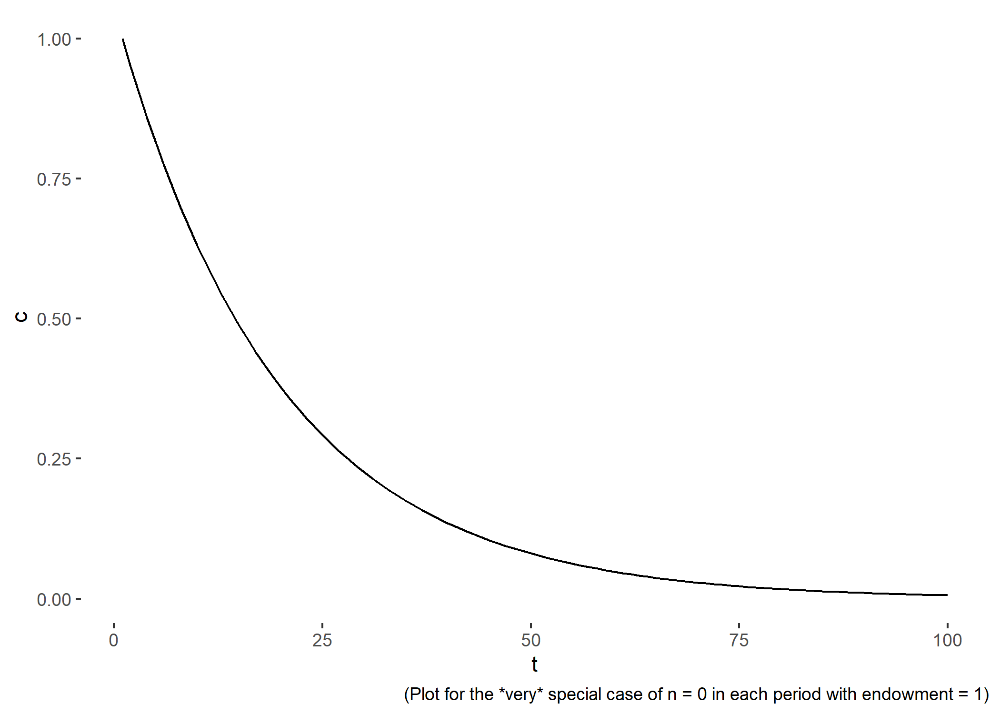

# A cake-eating problem

## Objective

Let's just look at the case where we have income $y_t$ in period $t$, and we need to choose consumption $c_t$ to maximize utility in each period of time. So our problem is...

$$ \max_{\vec{c}} \sum_{t=0}^{T} \beta^{t}u(c_t)$$ 

Supposing this actually has a maximum (It's a convex optimization problem so it does) we can define the above as a value function...

$$V_0 = \max_{\vec{c}} \sum_{t=0}^{T} \beta^{t} u(c_t)$$

We can break apart this sum into the period $t=0$ and everything after. That means we can re-write the value function:

$$V_0 = \max_{c} u(c) + \beta V_{1}(c')$$

Where $c$ is current consumption and $c'$ is one-period-ahead consumption

## Constraint

In each period we have some income $y_t$ which we may have to work for, or it may be an endowment. (This is a general setup, we can specify how income works in any number of ways by modifying this.) Either way, we only have 2 things to do with income: Consume it or save it. Out budget, in this way, can be written as:

\begin{align*} y_{t} + s_{t-1} &= c_{t} + s_{t} \\ \Rightarrow s_{t} &= y_{t} + s_{t-1} - c_{t}
\end{align*}

First, using the left-most equality above, we can write one-period-ahead consumption like so...

\begin{align*} c_{t+1} &= y_{t+1} + s_{t} - s_{t-1} \\ &= y_{t+1} + (y_{t} + s_{t-1} - c_{t})  - s_{t-1} \\ &= y_{t+1} + y_{t} - c_{t}
\end{align*}

...Better yet, using out one-period-ahead notation to simplify:

\begin{align*}

c_{t+1} &= y_{t+1} + y_{t} - c_{t} \\
\Leftrightarrow c' &= y' + (y - c)

\end{align*}

This is really intuitive. Tomorrow we can consume from our income tomorrow (whatever it may be-- it could just be labor income, or it could be a new endowment, or it could be zero!) *plus* whatever we have left over from last period. It makes perfect sense-- a nice "sanity check" so to speak.

## The consumer problem in one-step-ahead/sequence form

Using the above 2 results let's write this problem in a siple, one-step-ahead form.

$$ \max_{c} u(c) + \beta V(c')$$

...subject to...

$$ c' =  y' + (y - c)$$

Last step: Substitute $c'$ into the objective so we have no constraint!

$$ \Rightarrow \max_{c} u(c) + \beta V(y' + (y - c))$$

This bad boy can be solved exactly the way you'd think to solve it. Take that derivative-boye and set it to zero...

$$ \frac{\partial V }{\partial c} + \beta \frac{\partial V}{\partial c'} \frac{\partial c'}{\partial c} = 0 $$

# Specific example

Let's take the following to (all) be given:

\begin{align*}

u(c) &= \ln (c) + b \ln (1-n) \\
t &\in \{0,1\} \\
W_0 &= 1 \\
w &= 1 \\ 
y &= wn = n 

\end{align*}

This format actually simplifies the problem quite a bit-- we can assume that savings in  $t=1$ is zero, and we can take the savings inherited in $t=0$ as $W_0 = 1$. Let's cast the problem in terms of $c_0 \equiv c$ and $c_1 \equiv c'$ and such...

$$ \tilde{V} = \ln (c) + b \ln (1-n) + \beta V $$

...Now let's look at the optimal condition from this angle, keeping in mind that $c' = n' + (1 + n - c)$...

\begin{align*} \frac{\partial \tilde{V}}{\partial c} = \frac{1}{c} - \frac{\beta}{(1 + n' + n -c )} = 0 

\end{align*}

Obviously this means that...

\begin{align*} 
( 1+ \beta ) c &= 1 + n' + n \\
c &= \frac{1 + n' + n}{1 + \beta }

\end{align*}

Using the intertemporal/lifetime budget constraint...

\begin{align*}

 c' &=  n' + (1 + n - c) \\
 
c' &= \frac{(1+\beta)}{1+\beta}(1 + n' + n) - \frac{1 + n' + n}{1 + \beta}\\ 
&= \frac{\beta (1 + n' + n)}{1 + \beta} \\
&= \beta c

\end{align*} 

Consumption in the future decreases relative to today. Maybe this is intuitive. When we plan our consumption, we gain less utility from one unit of consumption in the future ($c'$) than consumption today $c$ by a factor of $\beta$, so our consumption in the future is just scaled-down by the discount rate. $c' = \beta c$ is our result.

## Last note

If you take $c = c_0$, you can see that we can iterate this result forward as far as we want. Note that $c_1 = \beta c_0$; using the formula we solved, we can generalize to $c_t = \beta^t c_0$. I think this is a really nice general result. 


```r
library(ggplot2)

beta = 0.95 # Future is worth 5% less than today
T = 100
c  = rep(0,T)
W_0 = 1 # Endowment equals one
c[1] = W_0
for(t in 2:length(c) ){
  c[t] = beta * c[(t-1)]
}

ggplot( data = as.data.frame( c , t = c(1:T) )  , 
        aes(x = 1:T , 
            y = c ) 
        ) + 
  geom_line() + 
  labs( x = "t" , 
        y = "c" , 
        caption = "(Plot for the *very* special case of n = 0 in each period with endowment = 1)") + 
  theme( panel.background = element_rect( fill = 'white'))
```

<!-- -->
